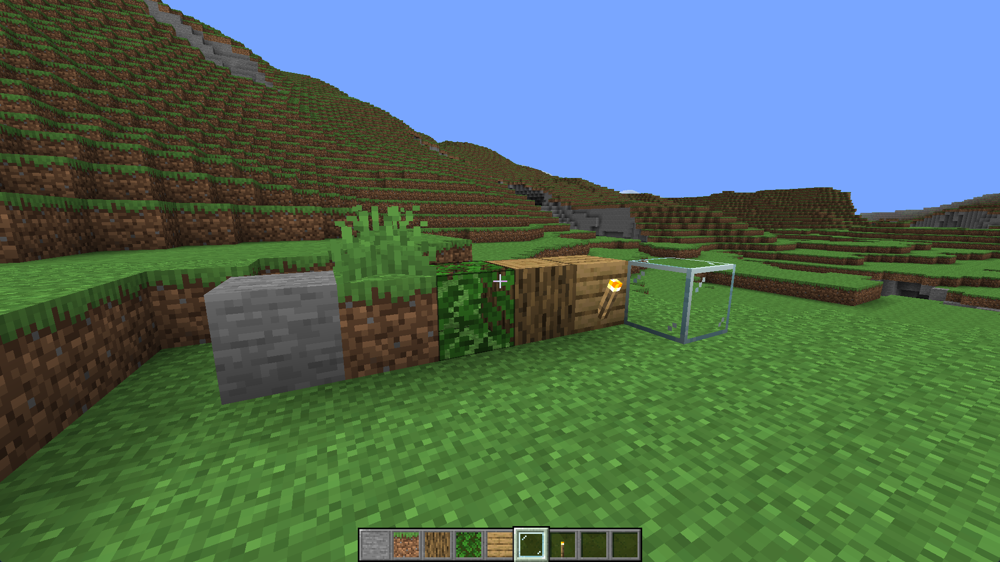
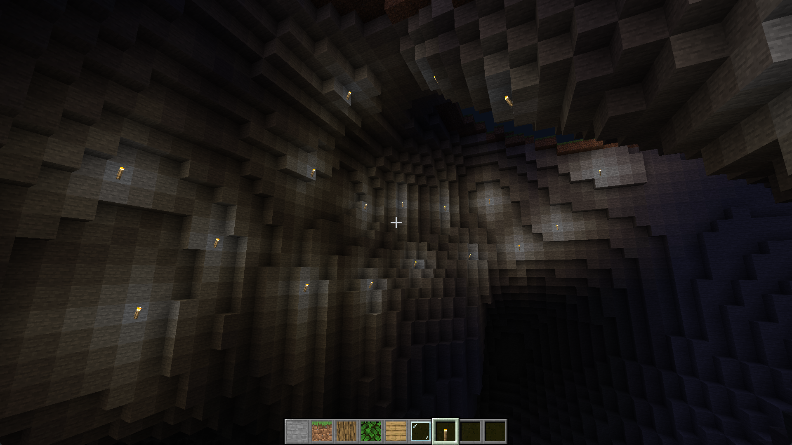
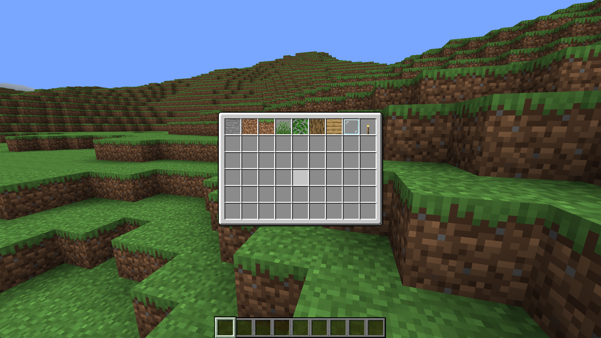
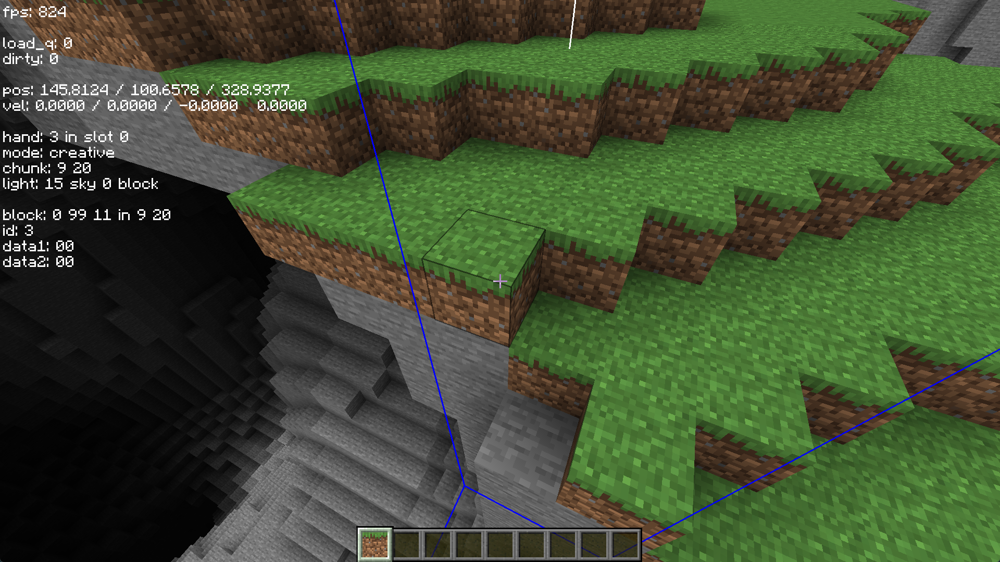
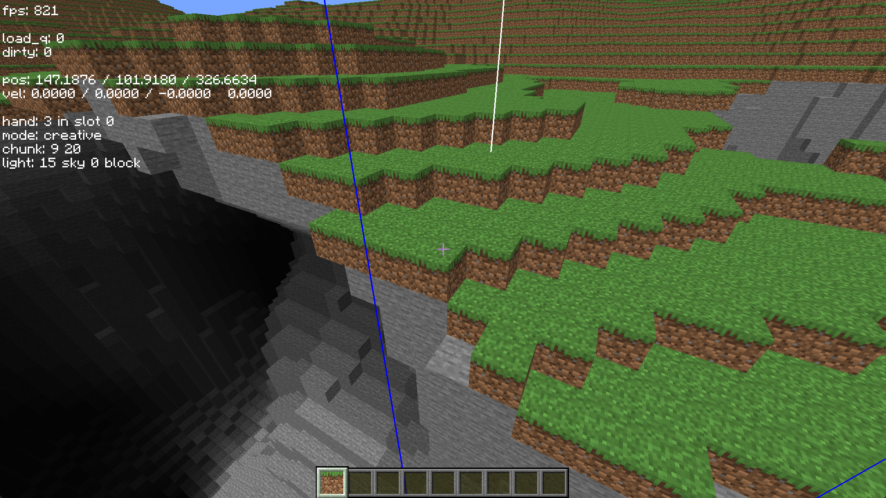
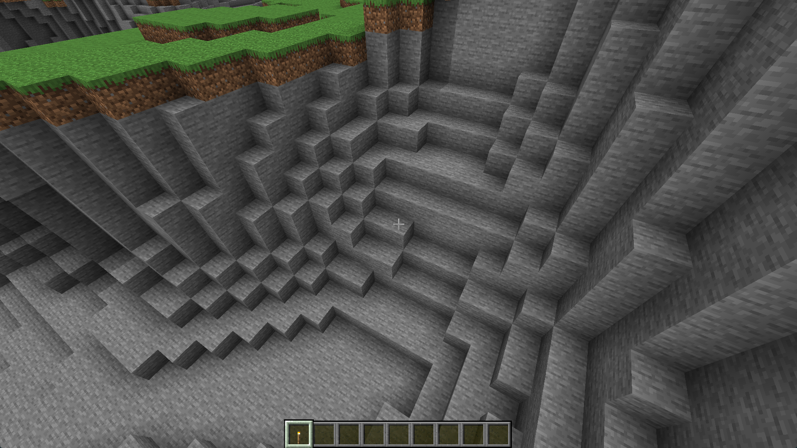
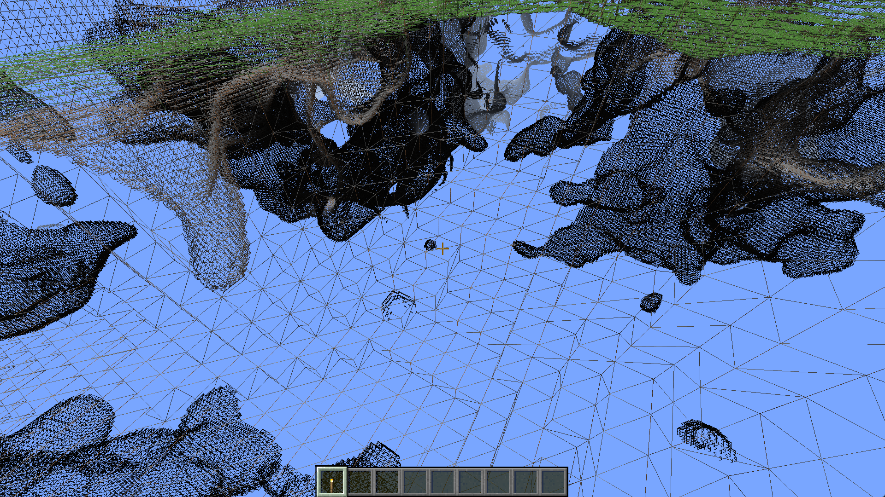

# Minecraft Clone in C++

This project is a Minecraft-inspired voxel game written in C++ with `OpenGL`. It uses `SDL` for window management, `stb_image` for texture handling, and `SimplexNoise` for procedural terrain generation. The game features chunk-based world generation, collision detection, block interaction, a block selection UI, and a day-night cycle with smooth lighting.

## Features

- **Chunk-Based Terrain Generation**: Generates voxel terrain dynamically using Simplex Noise for natural, varied landscapes.
- **Collision Detection**: Enables realistic player interaction with the world.
- **Block Interaction**: Includes basic mechanics for placing and removing blocks, allowing players to modify the environment.
- **Block Selection UI**: Provides a simple user interface to select and place various types of blocks.
- **Smooth Lighting**: Features a simple lighting model with point light sources and ambient occlusion, creating visuals similar to Minecraft.

## Screenshots

## Dependencies

- **[SDL2](https://www.libsdl.org/)**: Manages window creation and input handling.
- **[OpenGL](https://www.opengl.org/)**: Renders the voxel-based world and manages shaders.
- **[stb_image](https://github.com/nothings/stb)**: Loads texture images for blocks.
- **[SimplexNoise](https://github.com/SRombauts/SimplexNoise)**: Generates procedural terrain using simplex noise.

